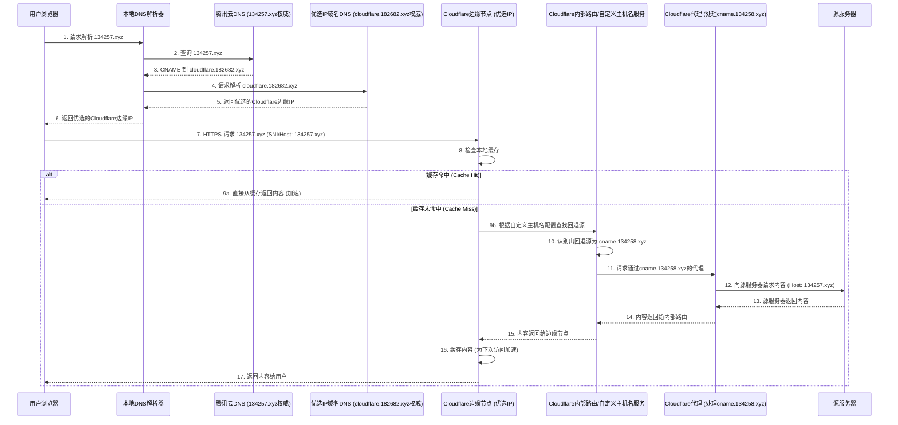

# 通过自定义主机名优化 Cloudflare CDN 的访问速度

> [!WARNING]
> 该教程经他人指出，有封号风险
> 所以请酌情使用

## 引言

Cloudflare 作为全球领先的网络性能与安全服务商，以 CDN 加速、DDoS 防护、WAF 防火墙、免费 SSL 证书 等核心能力享誉行业。其依托 Anycast 网络技术，让同一 IP 能在全球多节点宣告，理论上可自动路由用户请求至最近节点。

但国内用户访问时存在天然短板：免费版 Cloudflare 对中国大陆流量常默认路由至美国节点，叠加跨境链路波动、运营商路由策略差异等因素，导致延迟高、稳定性差，甚至被戏称为“赛博减速器”。

而 “优选 IP/CNAME”——通过测速、路由追踪、社区共享等方式，筛选出特定地区（如中国大陆）访问 Cloudflare 网络时延迟更低、丢包更少的节点 IP 或专用 CNAME 域名。结合 Cloudflare 「自定义主机名」（Cloudflare for SaaS 功能）与「回退源」机制，可精准定向优质节点，让国内用户体验更好。

## 准备工作

在动手配置前，需要准备两个域名和一张外币卡以及较好的网络环境：

1. **主域名**：`134257.xyz`（需加速的目标域名，这里以我自己的域名为例，不需要托管在 Cloudflare 上，我是放国内腾讯云处的）
2. **辅助域名**：`134258.xyz`（用于搭建 Cloudflare 内部“回退源”，需托管在 Cloudflare 上，也就是将该域名的 DNS 记录修改为 Cloudflare 分配的 DNS 地址）
3. **Cloudflare 账户**：似乎现在创建 Cloudflare 账户，以及开启 SaaS 功能都需要一张外币卡，国内 Visa 卡可过（我是自己的 Visa 卡过的）
4. **通畅的网络环境**：这个基本也是必须的，有些时候似乎不能直连 Cloudflare，需要自行准备

## 第一阶段：搭建 Cloudflare 回退源（配置辅助域名）

步骤一：先将辅助域名，我选择的是 `134258.xyz`（在实际操作时，你应该换成你自己买的属于你自己的辅助域名，而不是用我的辅助域名，主域名同理）接入到 Cloudflare

- 登录到 Cloudflare 控制台，右上角加号，添加“连接域”

- 在弹出来的界面输入你的辅助域名，下面的选项保持默认，然后点击“继续”
- Cloudflare 会自动扫描你当前域名的 DNS 记录情况，如果你是在腾讯云处购买的域名，那么你需要在腾讯云的[域名管理界面](https://console.cloud.tencent.com/domain/all-domain/all)找到你的辅助域名，将其 DNS 服务器修改为 Cloudflare 提供给你的新的 DNS 服务器

- 修改完毕之后，生效需要一段时间，一般是几个小时之后，等到 Cloudflare 那边显示正常，或者 Cloudflare 给你发邮件说成功添加了，那么就可以进行接下来的步骤了。下图是添加成功后的 Cloudflare 界面：

步骤二：配置回退源的 A 记录

- 进入到辅助域名的详细界面：

- 点击左侧栏的“DNS”下的“记录”，进入到“记录”界面，然后点击那个蓝色的“添加记录”按钮，添加一个记录：
    - 类型：A
    - 名称：cname（可以随意命名，我取这个名字便于分辨）
    - IPv4地址（内容）：你的网站源服务器的公网 IP 地址
    - 代理状态：打开（黄色启用状态，右边小黄云亮起，显示“已代理”）
    - TTL：保持默认即可

完成以上步骤之后，`cname.134258.xyz` 将成为 Cloudflare 内部指向源站的“稳定代理入口”（我这里还是以我自己的辅助域名为例，实际域名还是以你的实际情况为准）。

## 第二阶段：将主域名作为自定义主机名

步骤一：在 Cloudflare 中创建自定义主机名。同样的在这个辅助域名管理界面的左侧栏，找到“SSL/TLS”，点击其下方的“自定义主机名”，进入到“自定义主机名”界面。

- 在这里需要先设置好回退源，也就是将上一阶段的最后步骤得到的新的，指向你源服务器的辅助域名，填入到“回退源”内并保存。等待变成上图的绿色的“有效”状态
- 然后再点击蓝色的“添加自定义主机名”按钮，在新的界面添加自定义主机名。在新的界面中，自定义主机名一栏填写你需要加速的主域名，比如我的就是 `134257.xyz` ，其他的都保持默认即可，然后点击右下角的“添加自定义主机名”保存

- 添加好自定义主机名之后，“主机名”会显示待定状态，这个时候，需要去主域名的托管处，我的是[腾讯云](https://console.cloud.tencent.com/cns)，找到自己的主域名。添加一条 cname 解析到我们的辅助域名，也就是`cname.134258.xyz` 使它生效（你需要填写你自己的辅助域名而不是我的）：
    - 主机记录：@（这个就够了我觉得）
    - 记录类型：选择 CNAME
    - 线路类型：默认即可（除非你开了会员？有什么更高级的线路？）
    - 记录值：辅助域名（我的是 `cname.134258.xyz` 你需要改成你自己的）
    - 其他的保持默认

- 稍等片刻，再去看一下 Cloudflare，就会看到 Cloudflare 给我们提供了对于我们“自定义主机名”的“证书验证 TXT 名称”和“证书验证 TXT 值”（如果你的是“预验证”的话，等待一下就好），同时我们的“主机名”会显示一个蓝色的“待验证（TXT）”和一个绿色的“有效”，如果那个绿色的有效没有出来或者是红色的报错什么的，等待上一步的 cname 解析生效即可：

- 我上面这个图片是截图早了，等一会儿就不是“预验证”了，等到不是“预验证”的时候，再进行后续步骤

步骤二：添加 TXT 名称和值到我们的主域名解析处

- 回到[腾讯云](https://console.cloud.tencent.com/cns)自己的主域名解析处，添加一个新的 TXT 记录：
    - 主机记录：复制 Cloudflare 给的“主机名验证 TXT 名称”，左下角有个“单击以复制”，点击一下这行字就复制了，然后将后面的域名去掉就可以了（比如我复制的是 `_acme-challenge.134257.xyz` ，那么我应该填入的是 `_acme-challenge` 如下图所示）
    - 记录类型：选择 TXT
    - 线路类型：默认即可
    - 记录值：复制 Cloudflare 给的“主机名验证 TXT 值”，直接粘贴就好了，不需要做修改
    - 其他的保持默认

完成以上操作之后，稍等片刻，我等了十多分钟吧，等待“主机名”处变成如下所示的样子，就可以了：

这样主域名就配置好了 CDN 的同时还带上了自动续期的 SSL 加密证书。

至此，便配置好了 CNAME，但是这个时候还没有加速，因为我们还没有进行优选，优选的话可以通过以下开源项目来获取到优选的 IP：

> [XIU2/CloudflareSpeedTest](https://github.com/XIU2/CloudflareSpeedTest)

获取到之后，就可以在主域名处使用A记录解析Cloudflare比较快的IP即可（这张图片是网上找的，可以参考一下）：

或者你可以和我一样，采用别人已经优选好的：

> cloudflare.182682.xyz

维护者网站：https://www.wetest.vip

使用起来也比较容易，在你上述步骤都完成，且可以通过主域名成功访问到你的网站之后，在主域名解析处，将我们原本的 CNAME 记录直接替换为上面的 `cloudflare.182682.xyz` 即可：

至此便完成了 Cloudflare 的 CDN IP 优选加速。

那个辅助域名的有关设置均不可修改，保持在 Cloudflare 处即可，然后域名记得续费就好。

最后补充一下，建站的时候，比如用 1Panel 快速建站，域名就是我们加速的主域名。比如你想让用户访问 `134257.xyz` 就可以访问到你的网站，那么建站的时候，设置的域名就应该是这个，而不是其他的。

## 一些补充

#### 优选原理图

由 Gemini 给出，仅供参考：

#### Q1：我不理解为什么我通过 `cname.134258.xyz` 这个辅助域名，在主域名处添加好 CNAME 记录并且验证成功后，就可以将这个辅助域名修改为 `cloudflare.182682.xyz` 了

> Gemini Answer：
>
> 好的，我们来拆解一下这个过程，希望能让你更清晰地理解。
>
> 这里有两个关键阶段：
>
> 1.  **验证和激活阶段**：让 Cloudflare 知道 `134257.xyz` 是你的，并且你希望通过 Cloudflare 的“自定义主机名”功能来处理它，同时为它颁发 SSL 证书。
> 2.  **日常运行阶段**：让用户通过优选 IP 访问 `134257.xyz`。
>
> 让我们看看 `cname.134258.xyz` （辅助域名）在这个过程中的具体作用：
>
> **阶段一：验证和激活 `134257.xyz` 作为自定义主机名**
>
> 在这个阶段，Cloudflare 需要你做两件事来验证 `134257.xyz`：
>
> *   **TXT 记录验证**：
>     *   你在主域名 `134257.xyz` 的 DNS 设置（腾讯云）中添加一条特定的 TXT 记录。
>     *   **作用**：这向 Cloudflare 证明了你对 `134257.xyz` 这个域名有控制权。这是颁发 SSL 证书和信任这个域名的基础。
>
> *   **初始 CNAME 记录指向辅助域名 `cname.134258.xyz`**：
>     *   你在主域名 `134257.xyz` 的 DNS 设置（腾讯云）中添加一条 CNAME 记录，指向你的辅助域名 `cname.134258.xyz`。
>     *   **作用**：
>         1.  **建立回源路径**：`cname.134258.xyz` 是你在 Cloudflare 上正常添加并开启代理的域名，它指向你的源服务器。通过将 `134257.xyz` CNAME 到 `cname.134258.xyz`，你告诉 Cloudflare：“当 `134257.xyz` 的自定义主机名生效后，请通过 `cname.134258.xyz` 的配置去回源。” 这就是你在 Cloudflare 后台设置“回退源 (Fallback Origin)”为 `cname.134258.xyz` 的实际体现。
>         2.  **SSL 证书颁发和主机名激活**：Cloudflare 在颁发证书和激活自定义主机名时，会检查这个 CNAME。它需要确认请求能够通过 Cloudflare 的网络正确路由到你指定的（通过辅助域名间接指定的）源头。这确保了整个链路是通畅的。
>
> **一旦这个验证和激活阶段完成：**
>
> *   Cloudflare 内部已经记录了：
>     *   `134257.xyz` 是一个有效的自定义主机名。
>     *   `134257.xyz` 的 SSL 证书已经颁发并激活。
>     *   当收到针对 `134257.xyz` 的请求时，应该通过 `cname.134258.xyz` (作为回退源)的配置去获取内容。
>
> **阶段二：切换到 `cloudflare.182682.xyz` 进行日常访问**
>
> 现在，因为 Cloudflare 的内部系统已经“认识”了 `134257.xyz` 并知道如何处理它（特别是如何回源到 `cname.134258.xyz`），你就可以更改 `134257.xyz` 的 CNAME 记录了。
>
> *   你将 `134257.xyz` 在腾讯云的 CNAME 记录从 `cname.134258.xyz` 修改为 `cloudflare.182682.xyz`。
> *   **为什么这样可行？**
>     1.  **请求入口改变**：`cloudflare.182682.xyz` 是一个解析到 Cloudflare 优选 IP 池的域名。现在，当用户访问 `134257.xyz` 时，他们的请求会通过这些优选的 Cloudflare IP 进入 Cloudflare 的网络。
>     2.  **Cloudflare 内部识别和路由**：当请求到达这些优选 IP 时，Cloudflare 的服务器会查看请求头中的主机名（即 `Host: 134257.xyz`）或 SNI 信息。
>     3.  由于在第一阶段 `134257.xyz` 已经被成功设置为自定义主机名，并且其回退源被指定为 `cname.134258.xyz`，Cloudflare 的系统会识别出这个主机名。
>     4.  然后，Cloudflare 会根据其内部保存的这个自定义主机名配置，**依然按照“回退源是 `cname.134258.xyz`”的规则**，通过 `cname.134258.xyz` 在 Cloudflare 上的设置（最终指向你的源服务器）去获取内容。
>
> **总结一下关键点：**
>
> *   **初始 CNAME 到辅助域名 `cname.134258.xyz` 是为了完成 Cloudflare 对自定义主机名 `134257.xyz` 的验证、SSL 证书颁发以及建立正确的回源链路。** 这是告诉 Cloudflare：“嘿，`134257.xyz` 是我的，我想让你用这种方式（通过 `cname.134258.xyz`）来代理它。”
> *   **一旦 Cloudflare 内部的这个“自定义主机名配置”被激活并保存下来，它就独立于外部 DNS 的 CNAME 指向了。** Cloudflare 已经“记住”了 `134257.xyz` 的处理方式（回源到 `cname.134258.xyz`）。
> *   之后，你将 `134257.xyz` 的 CNAME 指向 `cloudflare.182682.xyz`，仅仅是改变了流量进入 Cloudflare 网络的“入口点”，选择了更优的入口。但进入网络后，Cloudflare 仍然会根据它已经保存的自定义主机名配置来处理这个请求。
>
> 把辅助域名 `cname.134258.xyz` 想象成在 Cloudflare 系统内注册的一个“锚点”或“代理指令”，它告诉 Cloudflare 如何找到你的真实服务器。自定义主机名 `134257.xyz` 则利用了这个锚点。初始的 CNAME 是为了建立和验证这个利用关系。验证通过后，只要请求能带着 `134257.xyz` 这个主机名到达 Cloudflare 的任何服务器，Cloudflare 就能根据已存的配置找到那个锚点并正确回源。

#### Q2：这样配置好后可以一直生效么？如果 SSL 证书过期了怎么办？还会正确颁发证书和续期吗？

> Gemini Answer：
>
> 是的，这个设置**通常可以一直生效**，并且 Cloudflare **会自动处理 SSL 证书的续期**，前提是所有相关的配置保持不变且有效。
>
> **关于长期生效：**
>
> 1.  **Cloudflare 自定义主机名配置的持久性**：一旦你在 Cloudflare 中成功配置了 `134257.xyz` 作为自定义主机名，并将其回退源设置为 `cname.134258.xyz`，这个配置会一直保留在 Cloudflare 的系统中，除非你手动删除它。
> 2.  **辅助域名 `cname.134258.xyz` 的配置**：你的辅助域名 `cname.134258.xyz` 必须持续在 Cloudflare 上保持激活状态，开启代理，并且其 DNS 记录（通常是 A 记录）正确指向你的源服务器。这是回源链路的关键。
> 3.  **主域名 `134257.xyz` 的 CNAME 记录**：你在腾讯云上为 `134257.xyz` 设置的 CNAME 记录指向 `cloudflare.182682.xyz`（或其他优选 IP 服务）必须保持。如果 `cloudflare.182682.xyz` 这个服务失效或不再提供优选 IP，你可能需要更新这个 CNAME 到其他有效的 Cloudflare 优选 IP 解析服务，或者暂时改回指向你的辅助域名 `cname.134258.xyz`。
> 4.  **TXT 验证记录**：添加的 TXT 记录最好也一直保留在你的 DNS 设置中。虽然主要用于初始验证，但 Cloudflare 有时可能会在续期或进行其他检查时再次查询它。
>
> 只要以上这些环节都保持配置正确，这个加速方案就会持续生效。
>
> **关于 SSL 证书续期：**
>
> 1.  **Cloudflare 自动管理**：对于通过 Cloudflare 代理并使用其自定义主机名功能的域名，Cloudflare 会自动管理其 SSL 证书的生命周期，包括在证书到期前进行续期。
> 2.  **续期方式**：
>     *   **HTTP-01 验证**：由于你的主域名 `134257.xyz` 的流量是通过 CNAME 指向 `cloudflare.182682.xyz`，最终通过 Cloudflare 的服务器进行代理的，Cloudflare 可以在其自己的服务器上完成 HTTP-01 验证来续期证书。这是最常见和无缝的方式。Cloudflare 会在其边缘节点上响应 Let's Encrypt (或其他 CA) 的验证请求。
>     *   **DNS-01 验证 (TXT 记录)**：Cloudflare 也可能依赖于你初次设置的 TXT 记录，或者在续期时要求更新/添加新的 TXT 记录。但对于已经通过其代理的自定义主机名，HTTP-01 通常更为便捷。
> 3.  **前提条件**：
>     *   自定义主机名 `134257.xyz` 在 Cloudflare 中必须保持“有效”状态。
>     *   回退源 `cname.134258.xyz` 必须配置正确且有效。
>     *   `134257.xyz` 的流量必须能正确路由到 Cloudflare 的网络（即 CNAME 记录有效）。
>
> **总结来说：**
>
> 是的，Cloudflare 会努力确保你的自定义主机名的 SSL 证书自动续期，你不需要手动干预。只要你的整体配置（Cloudflare 内部设置、DNS 记录）保持不变，并且你的域名持续通过 Cloudflare 的网络提供服务，证书续期通常是无缝的。
>
> **需要注意的潜在问题点（虽然不常见）：**
>
> *   如果 `cloudflare.182682.xyz` 这个第三方优选 IP 服务出现问题，导致流量无法到达 Cloudflare，可能会影响 HTTP-01 续期。
> *   如果你不小心删除了关键的 DNS 记录（如 TXT 记录，或修改了 CNAME 使其不再指向 Cloudflare 网络）。
> *   Cloudflare 平台自身的服务中断（非常罕见）。
>
> 因此，建议偶尔检查一下 Cloudflare 仪表盘中自定义主机名的状态，确保一切正常。

